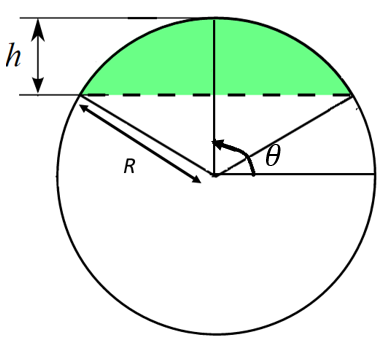

#d3-csegment
A D3-JS plugin for drawing circular segments.

## Installing
Download zip: https://github.com/chandramouli-sastry/d3-csegment/archive/master.zip

## Example Usage
The following code shows a simple use case. Refer to the image embedded below.
<pre>var csegment = d3.csegment()
                 .radius(50) // the radius of the circle
                 .height(40); // the height of the circular segment
                 
svg.append('path')
   .attr('d',csegment)
   .attr('fill','green');`</pre>
## Circular-Segment
The following image aids in understanding the API. You can read more at: http://mathworld.wolfram.com/CircularSegment.html 

</img>

## API Reference
<a href="#csegment" name="csegment">#</a> d3.<b>csegment</b>()

Creates a new csegment generator.

`var csegment = d3.csegment();`

<i>csegment.radius(d)</i>

Sets the radius to d and returns the generator. As of this version, d is expected to be a constant. If no arguments are passed, the radius is set to `undefined`.

<i>csegment.height(d)</i>

Sets the height of the circular segment to d and returns the generator. The height should be lesser than or equal to the radius. If it is equal to the radius, it draws a semi-circle. As of this version, d is expected to be a constant. If no arguments are passed, the height is set to `undefined`.

<i>csegment.angle(d)</i>

Sets the inclination of the central axis of the circular segment with respect to +ve x-axis and returns the generator. As of this version, d is expected to be a constant. It defaults to `Math.PI/2`. 

Refer to this <a href='https://github.com/chandramouli-sastry/d3-csegment/blob/master/csegment-example.html'>Example</a> for usage with d3 enter method.
